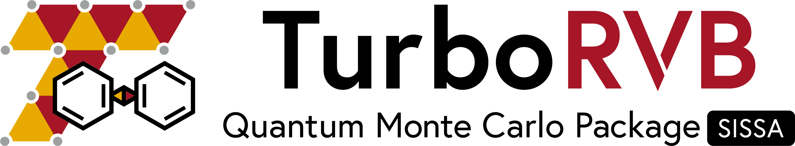

# SISSA Quantum Monte Carlo package

[TurboRVB](https://turborvb.sissa.it) is an open-source computational package for **ab initio Quantum Monte Carlo (QMC) simulations** of both molecular and bulk electronic systems. The code was initially launched by **Sandro Sorella** and **Michele Casula** in SISSA and has been continuously developed by many contributors for over 20 years. The code implements two types of well established QMC algorithms: Variational Monte Carlo (VMC), and Diffusion Monte Carlo in its robust and efficient lattice regularized variant (LRDMC).
